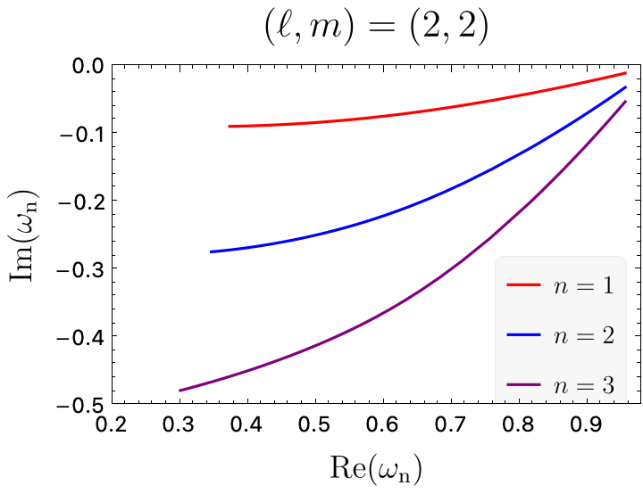

# MathematicaQNM
Interpolate the QNM frequencies for Kerr BHs from the pre-computed data from [Berti et al](https://arxiv.org/abs/0905.2975) for a ready-to-use Mathematica implementation, which I found lacking in the BHPT. 

Please, file an issue or a pull request if you find any bug or want to help with the development.

# Requirements

+ A Mathematica installation
+ Any Python basic set-up (only tested with 3.10). 

# Installation

1. Clone the repository and place it in any directory within Mathematica's $Path (if you don't know which are those, you can run ``$Path`` in any Mathematica session. 

2. Copy or move the file "KerrQNMs.wl" to the same level as the repository. 

For example, if you navigate to ``~/Library/Mathematica/Applications``, clone the repository there, and then do ``cp MathematicaQNM/KerrQNMs.wl .``, the structure should look like this: 

```bash
|-- Applications
|   |-- KerrQNMs.wl 
|   |-- MathematicaQNM
|   |   |-- Example.nb
|   |   |-- LICENSE
|   |   |-- UnzipQNMs.py
|   |   |-- CompressedData
|   |   `-- QNMData
|   |       |-- l2
|   |       |-- l3
|   |       |-- l4
|   |       |-- l5
|   |       |-- l6
|   |       `-- l7

```
                                                   
# Usage

Load the module in any Notebook by calling ``<<KerrQNMs` ``
Then, the main function that the module provides is ``KerrQNM[l, m, n]``. 

+ l = Angular number (Positive Integer or zero)
+ m = Azimuthal number (Integer between -l and l)
+ n = Overtone index (Integer, fundamental mode is n = 1). 

See Example.nb for an example usage. The example notebook uses the MaTeX package to produce the plot, but the evaluation should work without that package. With that, you should be able to produce a plot like this one:


